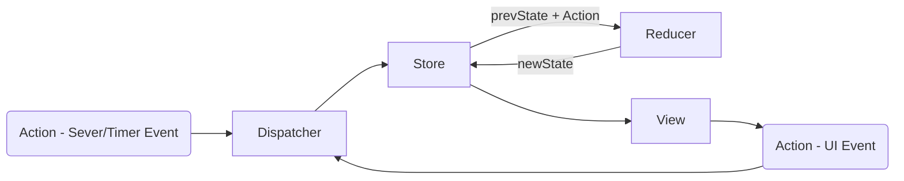

This project was bootstrapped with [Create React App](https://github.com/facebookincubator/create-react-app).

Deleted the contents of

- public
- src

Recreate public/index.html and src/index.js

## Table of Contents

- [JSX Javascript XML](#jsx)
- [Styling](#styling)
- [React State](#react-state)
- [Events](#events)
- [Lifecycle Events](#lifecycle-events)
- [Validating Props](#validating-props)
- [Key](#key)
- [Component Types](#component-types)
- [React Router](#react-router)
- [Redux](#redux)

## JSX

Javascript XML Follows the rules of XML

- Single Parent root element
- tags should be properly close
- case-sensitive
- proper nesting of tags
- attribute values must be enclose within quotes(single or double)
- attribute values other than string can be passed as expressions (Ecample: <Hello val={100}>)
- html attribute names must be camel case (example: class as className, onclick as onClick)
  #JSX Expression
- IF and FOR cannot be used inside the JSX (<Hello>{ no if or for loop }<//Hello>). However, conditional expression(?:) is allowed.

## Styling

- Inline style should be only objects unlike html string
- style attribute value in html { color: "red"; font-size: 30;} has to converted to equivalent object in jsx as {color: "red", fontSize: 30}
- External or Internal CSS as be utilized

## React State

- Makes the page dynamic in response to either time or user event or server rendering or ajax calls.
- Do NOT modify props
- State is immuetable, use setState() to modify the state
- States can be used only with Class components. Function components would not handle state and use only props.
  _Interactions_
  - Parent to Child is the only way to interact, i.e no child to parent or siblings interactions. But it can be achieved through design patterns.
    Refer 2a_Events

## Events

- Events are sythesized events, doesn't interact with real DOM
- Event params are accessed with target (like ev.target.value or ev.target.checked)

## Lifecycle Events

Refer 3_Lifecycle

1.  Mounting Phase
2.  Updating Phase
    a. State Changes
    b. Property Changes
    c. Parent Updates
3.  Unmounting Phase

|      | Mounting Phase     | Update Phase              | Unmounting Phase     |
| ---- | ------------------ | ------------------------- | -------------------- |
|      | contructor         |                           |                      |
|      |                    | componentWillReceiveProps |                      |
|      |                    | shouldComponentUpdate     |                      |
| WILL | componentWillMount | componentWillUpdate       | componentWillUnmount |
|      | render             | render                    |                      |
| DID  | componentDidMount  | componentDidUpdate        |                      |

## Validating Props

Good practice to validate props. A warning will be shown only in the development mode.

> npm install --save prop-types

[prop-types](https://www.npmjs.com/package/prop-types)

## Key

- Key ensures that diffing and Reconciliation takes place in an efficient manner.
- Key should be unique
- Elements generated in a iteration should have key
  _Usual approach_

> <ul\>
> <li\>red</li\>
> <li\>green</li\>
> </ul\>

_Good approach_

> <ul\>
>
> <li key="red"\>red</li\>
> <li key="green"\>green</li\>
> <li key="blue"\>blue</li\>
> </ul\>

## Component Types

1.  Controlled Components (Two way binding)

- Values are binded with State with handlers on each of the control
- Two way binding, i.e the values/changes are written back to the html controls and also maintained by the react's state

2.  Uncontrolled Components (One way binding)

- Usage of 'ref' attribute to the components
  > <input type='text' ref={ node=>{
  > this.instancevariable = node; } }\/>
- when using ref you cannot use 'value' attribute
- One way binding, i.e control changes are binded only on one action of the form

## React Router

> npm install --save react-router-dom

-"exact" does a exact match with the Link to -> Route path
BrowserRouter in index.js has to wrapped root component which has Link or NavLik and Route components

-Use HashRouter, only when it is a static content loading other wise the recommendation is to use BrowserRouter which could help server get the access log

_Redirect and Prompt_

> Refer 7a_ReactRouter

_Route Params_

> <Route path="//aboutus//:id" component={AboutUs} //>

It can be access via this.props.params

_Passing attribute to Components called in Route_

> Refer 7b_ReactRouter

<Route
path="//get//:id"
render={() => {
const Temp = withRouter(GetInfo);
return <Temp attr1="test" //>;
}}
//>

- Use withRouter, if you want to pass attributes to the components via the route

## Redux

1.  Immutability
    Do not modify the inputs. Manipulate on the copy of input.
    reducer
2.  Pure Functions
    Don't use global variable
    No Input/output
    Don't make DB/API Calls
    Don't Mutate object params

FLUX Patterns

1.  Create a View
2.  Create a Store
3.  Create Reducer - with default state and handle actions and always returns a state
4.  Design Actions - with store dispatcher
    a. Bind the actions to view - say onclick of button, invoke the action function to dispatch to store
5.  Binding View to Show the Store Values
    a. Use the store subscribe(), which is called whenever the store changes
    b. access the store objects via getState()
